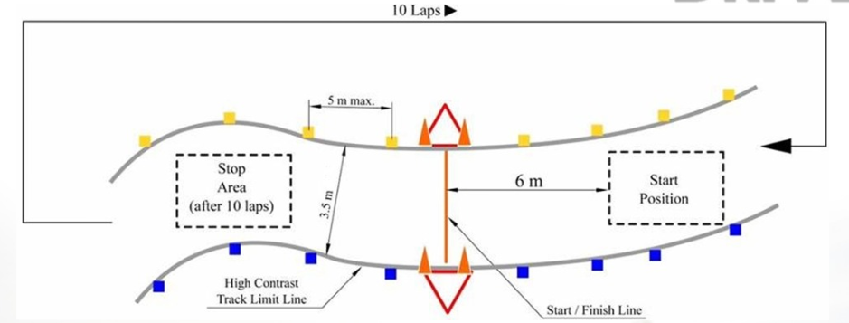
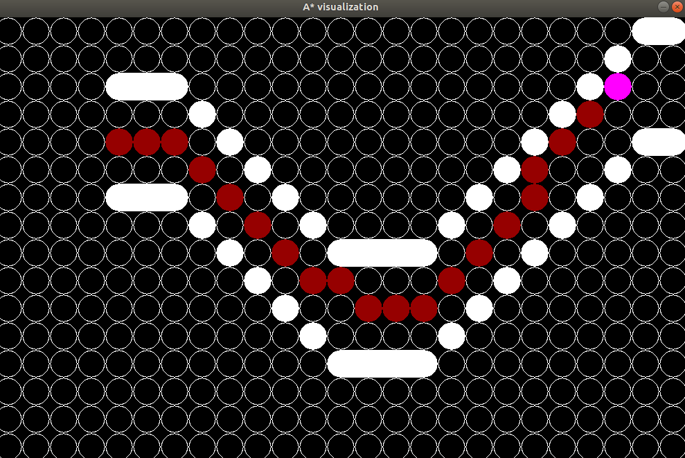

* Propose some planning technique for the problem mentioned above:
  * according to the three list of cones (the specifications about the relative positioning can be found in the figure above and you can use whatever circuit’s shape you prefer): orange, blue, yellow, find a feasible path that never crashes into cones

Some initial assumption. From SLAM we would receive a constructed map of the environment and the location of the car itself in that environment. Basically we would be constantly checking a topic for map updates and then performing nav decisions and publishing that to a different topic.

Let's assume the map we get from SLAM is an 2 dimensional array where, say a yellow cone is represented by 1, blue cone with 2, orange cone with 3, free road with 0 and the car with 4's. I'm not sure how far the SLAM is accurate but depending on that we would have different update rates.

- [0,1,0,1,0,1,]     Example grid
- [0,0,0,0,0,0,]
- [4,4,0,0,0,0,]
- [4,4,0,0,0,0,]
- [0,0,0,0,0,0,]
- [0,2,0,2,0,2,]

I think a key aspect would be identifying turns, because it is important we have a good race line through them to maintain speed. For example we want to be close to the blue cones if we identify that a left turn is coming. So, if we would use A* to create a good path, our real challenge would be choosing a goal position. Perhaps this could be done with a few heuristics, like, if we are in a left turn hug the right side etc. Probably would need to keep track of the car's direction and then determine the road ahead from that. Lets assume that the direction is to the right ->, then there should only be three possibilities

1. Right turn (down)
2. Left turn (up)
3. Straight

We should be able to determine this by checking the walls ahead, in the grid. 

Or perhaps, we could always track each pair of parallel cones. Then we could say that we always want to be in between a pair of cones and adjust based on them. So, find the first set, identify the next pair, and create path to the midpoint between them. Repeat.

Here's a fast implementation of that, it is anything but robust but kind of works. Basically the car uses A* and sets its goal to next pair of cones.

The stop area should not be too difficult, we should be able to record that area in the previous laps.

* Code structure of the solution
  * A main class that gather the map information and publish the path
  * A navigator class that using a map proposes a path through
    - Should probably have a dynamic grid that is filled with the information given by the main class. Then we should be able to make better and better pathing-suggestions each lap.
  * Possibly sub-classes to the navigator class depending on implementation.

* If we talk about the cone implementation, it could be decent. The good part about it is that the car will always stay on the track and follow the road. But there is of course a lot of improvements to be made. It feels like the biggest problem with using A* is identifying a good goal position for each iteration. It is the same here, it is completely reliant on good cone positioning for it to work. And that seems kind of foolish. Alternatively you could use this implementation for the first laps until you've mapped the track fairly accurately and then switch to an optimized version of, e.g. A*.
* It is not a very dynamic approach, feels very hard coded. It might be better to simply draw lines between each cone to create a 'wall' but it is still the problem of choosing checkpoints positions. Also, it completely disregards any optimal race line and limitations of the car.
* I would definitely need to study how A* is used in these sort of dynamic environments and specifically how to identify checkpoints. From reading the material it is also evident that there is a lot of other options to A* that I should look into.
